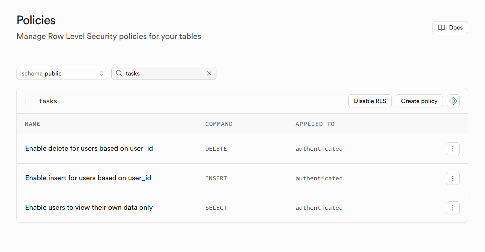

2. Configure Supabase Auth Webhook
In Supabase Dashboard:
Auth → Hooks → Add Hook
Hook Type: User Created
URL:
https://<project-id>.functions.supabase.co/create-user-folder

### Supabase storage RLS policy

### Supabase row level policy on `tasks` table

